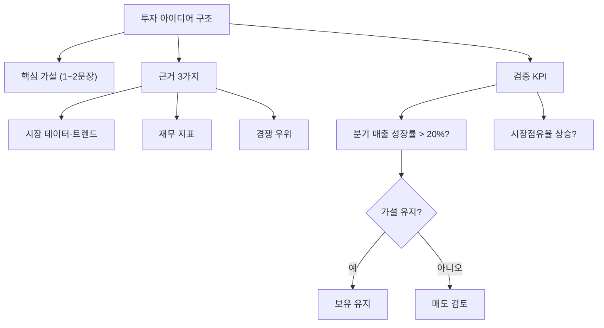

# 투자 아이디어(Investment Thesis)

## 한 줄 정의

투자 아이디어(Investment Thesis)는 특정 기업에 투자하는 이유를 논리적으로 정리한 핵심 가설입니다.

## 아주 쉽게 말하면

"왜 이 회사 주식을 사는가?"에 대한 1-2문장짜리 명확한 답변입니다. 이것이 없으면 감으로 투자하는 것과 같습니다.

## 왜 중요한가

- 매수 이유가 명확해야 매도 시점도 판단할 수 있습니다
- 주가 하락 시 "버틸 근거"와 "손절 근거"를 구분해줍니다
- 감정적 의사결정을 방지합니다
- 시간이 지난 후 자신의 판단을 복기할 수 있게 합니다

## 그림으로 이해하기

## 숫자로 보는 예시

> ⚠️ 아래 숫자는 개념 설명을 위한 **가상 예시**이며, 실제 투자 데이터가 아닙니다.

| 항목 | 내용 |
|------|------|
| 대상 기업 | 가상 전자(가상) |
| 핵심 가설 | "전기차 부품 수요 증가로 매출 연 30 % 성장" |
| 근거 1 | 전기차 시장 연평균 25 % 성장 전망 |
| 근거 2 | 주요 완성차 3사와 공급 계약 체결 |
| 근거 3 | 경쟁사 대비 원가 20 % 낮음 |
| 검증 KPI | 분기 매출 성장률 25 % 이상 유지 여부 |
| 훼손 조건 | 주요 고객사 계약 해지 또는 성장률 10 % 미만 2분기 연속 |

## 표로 비교하기

| 구분 | 투자 아이디어 있음 | 투자 아이디어 없음 |
|------|-------------------|-------------------|
| 매수 근거 | 논리적·검증 가능 | "남들이 산다", "느낌" |
| 하락 시 대응 | 가설 점검 후 판단 | 공포에 매도 또는 무작정 버팀 |
| 매도 시점 | 가설 훼손 시 | 감정·뉴스 반응 |
| 복기 가능성 | 높음 (기록 존재) | 낮음 (근거 불명) |
| 학습 효과 | 매 투자마다 축적 | 같은 실수 반복 |

## 초보자가 자주 하는 오해

**오해 1: "좋은 회사 = 좋은 투자 아이디어"**

아무리 좋은 회사여도 주가가 이미 모든 것을 반영했다면 수익이 나지 않습니다. 투자 아이디어는 "시장이 아직 반영하지 못한 것"을 찾는 것입니다.

**오해 2: "한번 세운 아이디어는 끝까지 유지해야 한다"**

환경이 변하면 아이디어도 수정해야 합니다. 고집은 전략이 아닙니다. 정기적으로 가설을 재검증하는 것이 올바른 접근입니다.

## 고수는 이렇게 봅니다

- 투자 아이디어를 글로 작성하고 날짜를 기록합니다
- "이 가설이 틀렸다면 어떤 신호가 나타날까?"를 미리 정의합니다
- 실적 발표마다 KPI를 체크하고 아이디어 유효성을 재평가합니다
- 하나의 종목에 Bull case / Base case / Bear case 3가지 시나리오를 세웁니다

## 기업분석에서는 이렇게 씁니다

투자 아이디어는 기업분석의 출발점이자 결론입니다:
- 산업 분석 → 이 시장이 성장하는가?
- 경쟁력 분석 → 이 회사가 이길 수 있는가?
- 재무 분석 → 숫자가 가설을 뒷받침하는가?
- 밸류에이션 → 현재 가격에 충분한 upside가 있는가?

모든 분석의 결과가 하나의 문장으로 수렴되어야 합니다.

## 함께 보면 좋은 용어

- [손절](./stop-loss.md) — 아이디어 훼손 시 실행하는 행동
- [안전마진](./margin-of-safety.md) — 아이디어가 틀려도 손실을 줄이는 장치
- [밸류 트랩](./value-trap.md) — 잘못된 아이디어의 대표 사례
- [기업분석 프레임워크](./company-analysis-framework.md) — 아이디어를 체계적으로 구축하는 방법

## 정리

투자 아이디어는 "왜 사는가"를 한 문장으로 답할 수 있게 해주는 투자의 나침반입니다. 이것이 명확할수록 매수·보유·매도 모든 단계의 판단이 일관됩니다.

## 한 줄 요약

> 투자 아이디어는 "시장이 아직 모르는 이 회사의 가치"를 한 문장으로 정리한 매수의 이유입니다.

---

*면책 조항: 이 글은 투자 권유가 아니라 주식 용어와 기업분석 방법을 설명하기 위한 교육 콘텐츠입니다. 특정 종목의 매수·매도 판단은 독자 본인의 책임입니다.*

Tags: 투자아이디어, 투자논리, 인베스트먼트씨시스, 매수근거, 기업분석
