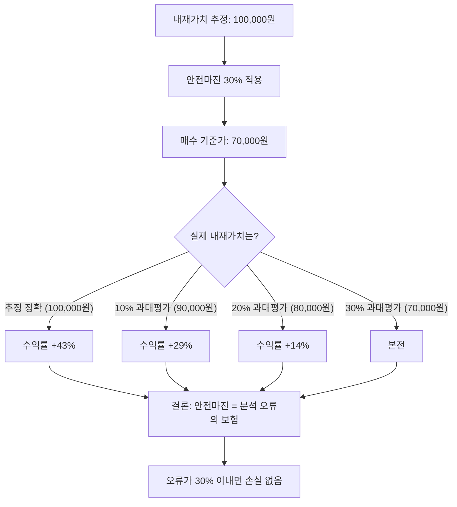

# 안전마진 뜻 — 적정가치보다 싸게 사서 확보하는 안전 여유분

## 한 줄 정의

안전마진(Margin of Safety)은 기업의 내재가치(적정가치)와 현재 주가 사이의 차이로, 판단 오류나 예상치 못한 위험에 대비하는 여유분입니다.

## 아주 쉽게 말하면

시가 10만 원짜리 아파트를 급매물로 7만 원에 사는 것과 같습니다. 설사 감정 평가가 10% 틀렸더라도, 7만 원에 산 사람은 여전히 손해 볼 가능성이 낮습니다. 반대로 10만 원에 산 사람은 조금만 잘못되어도 바로 손실 구간에 진입합니다. 이처럼 "내 분석이 틀려도 괜찮은 여유"가 안전마진입니다.

## 왜 중요한가

- 모든 내재가치 추정에는 오차가 존재하며, 안전마진이 이 오차를 흡수합니다
- 안전마진이 클수록 하방 리스크가 줄고, 상방 수익 기회는 커집니다
- 벤저민 그레이엄이 정립한 가치투자의 가장 핵심적인 원칙입니다
- "좋은 기업"과 "좋은 투자"는 다릅니다 — 가격이 결정적 차이를 만듭니다
- 시장 전체가 하락하는 위기 상황에서 안전마진이 심리적 버팀목이 됩니다

## 그림으로 이해하기

## 숫자로 보는 예시

> ⚠️ 아래 숫자는 개념 설명을 위한 **가상 예시**이며, 실제 투자 데이터가 아닙니다.

가상 기업 '한빛전자' 분석:

| 분석 항목 | 수치 |
|-----------|------|
| DCF 내재가치 | 50,000원 |
| 상대가치(PER 기준) | 55,000원 |
| 자산가치(PBR 기준) | 45,000원 |
| **보수적 내재가치(최솟값)** | **45,000원** |
| 현재 주가 | 32,000원 |
| **안전마진** | **(45,000 − 32,000) ÷ 45,000 = 29%** |

만약 내재가치를 20% 과대평가했다면 실제 가치는 36,000원 → 32,000원 매수가는 여전히 11% 상승 여력 보유. 반면 안전마진 0%(45,000원에 매수)였다면 20% 즉시 손실.

## 표로 비교하기

| 안전마진 수준 | 의미 | 적합한 상황 | 요구되는 분석 정밀도 |
|-------------|------|-----------|-------------------|
| 50% 이상 | 매우 높음 | 불확실성 큰 기업(턴어라운드, 적자 전환) | 낮아도 무방 |
| 30~50% | 높음 | 일반적 가치투자 기준 | 보통 |
| 15~30% | 보통 | 우량주·안정적 성장 기업 | 높은 정밀도 필요 |
| 15% 미만 | 낮음 | 리스크 관리 어려움 | 매우 높은 확신 필요 |
| 0%(적정가 매수) | 없음 | 분석 오류 여유 전무 | 현실적으로 위험 |

## 초보자가 자주 하는 오해

**오해 1: "좋은 회사면 아무 가격에나 사도 된다"**

아무리 좋은 회사라도 비싸게 사면 수익을 내기 어렵습니다. 2000년대 초 삼성전자를 당시 최고가에 산 투자자는 원금 회복에 수 년이 걸렸습니다. "좋은 회사를 싼 가격에" 사는 것이 핵심입니다.

**오해 2: "안전마진 30%면 30% 수익이 보장된다"**

내재가치 추정 자체가 틀릴 수 있습니다. 안전마진은 "수익 보장"이 아니라 "분석 오류에 대한 보험"입니다. 보험이 있다고 사고가 안 나는 것은 아닙니다.

**오해 3: "싼 주식이면 안전마진이 있는 것이다"**

절대 가격이 낮다고 안전마진이 있는 것이 아닙니다. 내재가치 대비 상대적으로 싸야 합니다. 5,000원짜리 주식이라도 내재가치가 3,000원이면 오히려 고평가입니다.

**오해 4: "DCF 하나로 내재가치를 정확히 알 수 있다"**

DCF는 가정(성장률, 할인율)에 민감합니다. 여러 방법으로 교차 검증하고, 가장 보수적인 값을 기준으로 안전마진을 산출하는 것이 현명합니다.

## 고수는 이렇게 봅니다

- 불확실성이 클수록 더 높은 안전마진을 요구합니다 (턴어라운드 기업은 50% 이상)
- 여러 방법(DCF, 상대가치, 자산가치, Sum-of-Parts)으로 내재가치를 교차 검증합니다
- 안전마진이 충분하지 않으면 아무리 좋은 기업이라도 '워치리스트'에 넣고 기다립니다
- "싼 이유"가 일시적(단기 악재)인지 구조적(사업 쇠퇴)인지 반드시 구분합니다
- 시장 전체가 공포에 빠질 때가 안전마진이 가장 커지는 시점임을 인지합니다

## 기업분석에서는 이렇게 씁니다

- 보수적 가정(낮은 성장률, 높은 할인율)으로 내재가치를 산출한 후 현재가와 비교합니다
- 시나리오별(낙관/중립/비관) 적정가치를 제시하여 안전마진 범위를 보여줍니다
- 안전마진이 30% 이상인 종목만 투자 후보 리스트에 올립니다
- 분기별 실적 발표 후 내재가치를 재산정하여 안전마진 변동을 추적합니다

## 함께 보면 좋은 용어

- [밸류트랩](./value-trap.md): 안전마진이 있어 보이지만 함정인 경우
- [PER](../level-05-valuation/per.md): 적정가치 산정의 기본 지표
- [PBR](../level-05-valuation/pbr.md): 자산 기준 안전마진 판단
- [가치주](../level-09-strategy-risk/value-stock.md): 안전마진을 추구하는 스타일
- [투자 아이디어](./investment-thesis.md): 안전마진을 포함한 투자 근거

## 정리

안전마진은 내재가치와 매수 가격의 차이로, 분석 오류와 예상치 못한 위험에 대비하는 여유분입니다. 불확실성이 클수록 더 높은 안전마진을 요구하며, 여러 방법으로 내재가치를 교차 검증한 뒤 가장 보수적인 값 기준으로 판단하는 것이 가치투자의 핵심 원칙입니다.

## 한 줄 요약

> 안전마진은 적정가치보다 싸게 사서 확보하는 안전 여유분이며, 투자에서 손실을 막는 첫 번째 방어선입니다.

---

이 글은 투자 권유가 아니라 주식 용어와 기업분석 방법을 설명하기 위한 교육 콘텐츠입니다. 특정 종목의 매수·매도 판단은 독자 본인의 책임입니다.

Tags: 안전마진, 내재가치, 할인매수, 가치투자, 리스크관리
