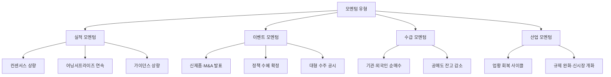

# 모멘텀 뜻 — 주가를 움직이는 힘 또는 계기

## 한 줄 정의

모멘텀은 주가가 특정 방향으로 움직이게 하는 동력이나 계기를 뜻합니다.

## 아주 쉽게 말하면

자전거를 생각해보세요. 페달을 밟는 힘이 있어야 앞으로 나갑니다. 주식도 마찬가지입니다. "실적이 좋아지고 있다", "정부 정책이 바뀌었다", "기관이 계속 사고 있다" — 이런 구체적인 힘이 있어야 주가가 움직입니다. 아무리 좋은 자전거(좋은 기업)라도 페달을 밟는 사람(모멘텀)이 없으면 제자리에 서 있습니다.

## 왜 중요한가

- **추세의 원인**: 주가가 오르는 데는 이유가 있고, 그 이유가 모멘텀입니다
- **시점 판단**: 좋은 기업이라도 모멘텀이 없으면 수 년간 횡보할 수 있습니다
- **투자 근거**: 기업분석에서 "왜 지금 이 주식인가"에 답하는 것이 모멘텀입니다
- **종합 판단**: 실적·이벤트·수급 등 여러 모멘텀이 겹칠수록 추세가 강해집니다
- **소멸 감지**: 모멘텀이 약해지는 시점을 알면 고점 매수를 피할 수 있습니다

## 그림으로 이해하기

_모멘텀은 하나가 아닙니다. 여러 유형이 겹칠수록 주가 움직임이 강해집니다._

## 숫자로 보는 예시

> ⚠️ 아래 숫자는 개념 설명을 위한 **가상 예시**이며, 실제 투자 데이터가 아닙니다.

가상 기업 '퓨처반도체'의 모멘텀 분석:

| 항목 | 3개월 전 | 현재 | 변화 | 모멘텀 유형 |
|------|----------|------|------|------------|
| 컨센서스 영업이익 | 500억 원 | 720억 원 | +44% 상향 | 실적 모멘텀 |
| 외국인 순매수 | 산발적 | 25거래일 연속 | 수급 전환 | 수급 모멘텀 |
| 신규 이벤트 | — | AI 가속기 수주 공시 | 대형 모멘텀 | 이벤트 모멘텀 |
| 산업 전망 | 재고 조정기 | 반도체 업사이클 진입 | 구조적 전환 | 산업 모멘텀 |
| 주가 | 30,000원 | 45,000원 | +50% | 복합 모멘텀 효과 |

4가지 모멘텀이 동시 발생하면서 강한 상승 추세가 형성된 사례입니다.

## 표로 비교하기

| 모멘텀 유형 | 지속 기간 | 강도 | 예시 | 소멸 신호 |
|------------|----------|------|------|----------|
| 실적 모멘텀 | 3~12개월 | 매우 강함 | 연속 어닝서프라이즈, 컨센서스 상향 | 컨센서스 하향 전환 |
| 산업 모멘텀 | 6~24개월 | 강함 | 업황 회복 사이클, 정책 전환 | 재고 재축적, 가격 하락 |
| 이벤트 모멘텀 | 1~4주 | 중간 | 신제품, 대형 수주, M&A | 기대 선반영 완료 |
| 수급 모멘텀 | 2~8주 | 중간 | 기관 매집, 외국인 순매수 | 매수 주체 이탈 |
| 기술적 모멘텀 | 1~4주 | 약함 | 저항선 돌파, 거래량 급증 | 거래량 감소, 음봉 전환 |

## 초보자가 자주 하는 오해

**오해 1: "모멘텀 투자 = 오르는 주식 무조건 따라 사기"**

모멘텀 투자는 "왜 오르는지" 원인을 파악하고, 그 원인이 지속될지 판단한 뒤 투자하는 것입니다. 이유 없이 오르는 것을 쫓으면 고점 매수 위험이 큽니다.

**오해 2: "좋은 회사면 모멘텀 없어도 주가가 오른다"**

아무리 펀더멘털이 좋은 기업이라도 주가를 움직일 계기가 없으면 장기간 횡보하는 경우가 매우 흔합니다. 가치와 시점(타이밍) 모두 중요합니다.

**오해 3: "모멘텀은 단기 트레이더만 쓰는 개념이다"**

장기 가치투자자도 "왜 지금 사는가(시점의 근거)"를 설명하려면 모멘텀이 필요합니다. 모멘텀은 단기/장기와 무관하게 투자 시점을 결정하는 보편적 개념입니다.

## 고수는 이렇게 봅니다

- **실적 모멘텀 최우선**: 컨센서스 상향 추이를 가장 먼저 확인합니다
- **복합 모멘텀 선호**: 실적 + 산업 + 수급이 동시에 나타나는 종목에 우선순위를 둡니다
- **소멸 신호 감시**: 컨센서스 상향 정체, 가이던스 하향, 수급 이탈 등을 모멘텀 약화 신호로 봅니다
- **기간 설정**: 모멘텀의 예상 지속 기간을 설정하고, 소멸 시점에 포지션을 재점검합니다
- **역모멘텀 활용**: 악재가 출하(de-risk)되면 역발상으로 진입 시점을 모색합니다

## 기업분석에서는 이렇게 씁니다

- **"왜 지금?"에 답하기**: 투자 아이디어에서 모멘텀은 시점의 근거입니다
- **시작과 종료 조건 정의**: 모멘텀의 시작 시점, 예상 지속 기간, 소멸 조건을 미리 명시합니다
- **검증 KPI 설정**: 실적 모멘텀이면 분기별 컨센서스 변화, 이벤트 모멘텀이면 매출 기여 시점 등 확인 지표를 정합니다
- **모멘텀 강도 정량화**: "컨센서스 +30% 상향" 등 숫자로 표현하여 추적 가능하게 합니다

## 함께 보면 좋은 용어

- [컨센서스](../level-08-industry-macro/consensus.md): 실적 모멘텀의 핵심 지표
- [어닝서프라이즈](../level-08-industry-macro/earnings-surprise.md): 가장 강력한 실적 모멘텀
- [피크아웃](../level-08-industry-macro/peak-out.md): 모멘텀 소멸 시점
- [투자 아이디어](./investment-thesis.md): 모멘텀을 포함한 투자 근거 체계
- [리레이팅](../level-05-valuation/rerating.md): 모멘텀이 만드는 밸류에이션 상향

## 정리

모멘텀은 주가를 움직이는 동력이며, 실적·이벤트·수급·산업 등 여러 유형이 있습니다. 실적 모멘텀(컨센서스 상향, 어닝서프라이즈)이 가장 강력하고 지속적이며, 여러 모멘텀이 복합적으로 작용할수록 추세가 강해집니다. 모멘텀의 소멸 시점을 감지하는 것이 고점 매수를 피하는 핵심 기술입니다.

## 한 줄 요약

> 모멘텀은 주가를 움직이는 계기이며, 여러 유형의 모멘텀이 겹칠수록 추세가 강해집니다.

---

이 글은 투자 권유가 아니라 주식 용어와 기업분석 방법을 설명하기 위한 교육 콘텐츠입니다. 특정 종목의 매수·매도 판단은 독자 본인의 책임입니다.

Tags: 모멘텀, 실적모멘텀, 주가추세, 카탈리스트, 상승동력
