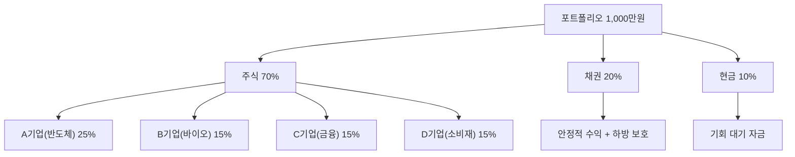

# 포트폴리오 뜻 — 내가 보유한 투자 자산의 전체 구성

## 한 줄 정의

포트폴리오는 투자자가 보유한 모든 투자 자산(주식, 채권, 현금 등)의 조합을 의미합니다.

## 아주 쉽게 말하면

냉장고에 담긴 식재료 전체 목록입니다. 어떤 재료를 얼마나 담느냐에 따라 만들 수 있는 요리(수익)와 상할 위험(손실)이 달라집니다.

## 왜 중요한가

- 개별 종목이 아닌 전체 포트폴리오 관점에서 리스크를 관리합니다
- 한 종목이 급락해도 전체 자산 피해를 제한할 수 있습니다
- 종목 수, 업종 배분, 현금 비중이 수익률과 변동성을 결정합니다
- "무엇을 사느냐"만큼 "얼마나 사느냐(비중)"가 중요합니다

## 그림으로 이해하기

## 숫자로 보는 예시

> ⚠️ 아래 숫자는 개념 설명을 위한 **가상 예시**이며, 실제 투자 데이터가 아닙니다.

포트폴리오 A (집중) vs B (분산):

| | 포트폴리오 A | 포트폴리오 B |
|---|---|---|
| 종목 수 | 3개 | 10개 |
| 최대 비중 | 50% | 15% |
| 최대 종목 -30% 시 | 전체 -15% | 전체 -4.5% |
| 상승장 수익률 | 높음 | 중간 |
| 하락장 손실 | 큼 | 작음 |

## 표로 비교하기

| 포트폴리오 유형 | 종목 수 | 특징 | 적합한 투자자 |
|---------------|--------|------|-------------|
| 초집중 | 1~3개 | 고수익/고위험 | 확신 높은 전문가 |
| 집중 | 5~10개 | 수익/위험 균형 | 개별 분석 가능한 투자자 |
| 분산 | 15~30개 | 안정적, 시장 수익률 추종 | 안정 추구 |
| 초분산(ETF) | 50개+ | 시장 평균 | 패시브 투자자 |

## 초보자가 자주 하는 오해

**오해 1: "종목이 많으면 분산이다"**

같은 업종 10개를 사면 분산이 아닙니다. 서로 다른 업종·스타일로 나눠야 진정한 분산입니다.

**오해 2: "좋은 종목을 골랐으면 비중은 상관없다"**

비중 관리가 수익률의 핵심입니다. 확신이 높은 종목에 적절히 비중을 실어야 합니다.

## 고수는 이렇게 봅니다

- 종목별 비중 상한(예: 20%)을 설정하여 집중 리스크를 관리합니다
- 업종·스타일(성장/가치)·시가총액 기준으로 분산합니다
- 시장 상황에 따라 현금 비중을 조절합니다 (불확실 시 현금 확대)
- 정기적으로 리밸런싱하여 목표 비중을 유지합니다

## 기업분석에서는 이렇게 씁니다

- 신규 편입 종목과 기존 포트폴리오의 상관관계를 확인합니다
- 포트폴리오 전체의 PER·배당수익률·베타를 관리합니다
- 리스크 기여도(한 종목이 전체 변동성에 미치는 영향)를 계산합니다

## 함께 보면 좋은 용어

- [분산투자](./diversification.md): 포트폴리오 구성의 핵심 원칙
- [집중투자](./concentration.md): 분산의 반대 전략
- [손절](./stop-loss.md): 포트폴리오 리스크 관리 방법
- [분할매수](./dollar-cost-averaging.md): 포트폴리오에 편입하는 방법
- [방어주](../level-09-strategy-risk/defensive-stock.md): 포트폴리오 안정성 담당

## 정리

포트폴리오는 투자 자산의 전체 구성입니다. 개별 종목 선택도 중요하지만, "얼마나(비중)" 담느냐가 수익률과 리스크를 결정합니다. 업종·스타일·현금 비중을 적절히 배분하고 정기적으로 리밸런싱하는 것이 포트폴리오 관리의 핵심입니다.

## 한 줄 요약

> 포트폴리오는 보유 자산의 전체 구성이며, "무엇을"보다 "얼마나" 담느냐가 성과를 결정합니다.

---

*면책 조항: 이 글은 투자 권유가 아니라 주식 용어와 기업분석 방법을 설명하기 위한 교육 콘텐츠입니다. 특정 종목의 매수·매도 판단은 독자 본인의 책임입니다.*

Tags: 포트폴리오, 자산배분, 종목구성, 비중조절, 투자전략
