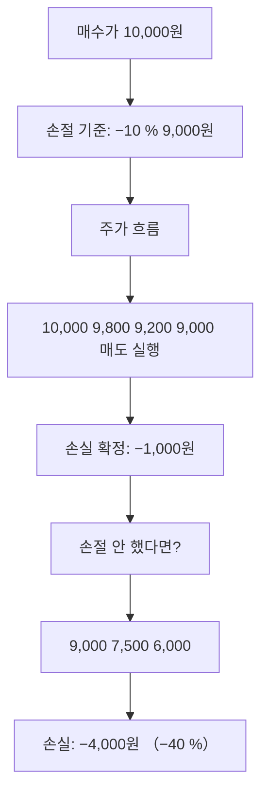

# 손절(Stop Loss)

## 한 줄 정의

손절은 보유 종목의 손실이 사전에 정한 기준에 도달했을 때 추가 손실을 막기 위해 매도하는 행위입니다.

## 아주 쉽게 말하면

"더 빠지기 전에 여기서 끊자"라고 미리 선을 긋는 것입니다. 감정이 아니라 규칙으로 파는 것이 핵심입니다.

## 왜 중요한가

- 소액 손실이 대형 손실로 번지는 것을 방지합니다
- −50 %가 되면 원금 회복에 +100 %가 필요합니다 — 수학적으로 불리합니다
- 감정적 물타기를 차단하여 자본을 보존합니다
- 다른 기회에 자본을 재배치할 수 있게 합니다

## 그림으로 이해하기

## 숫자로 보는 예시

> ⚠️ 아래 숫자는 개념 설명을 위한 **가상 예시**이며, 실제 투자 데이터가 아닙니다.

| 항목 | 수치 |
|------|------|
| 매수가 | 50,000원 |
| 손절 기준 | −10 % (45,000원) |
| 실제 매도가 | 45,000원 |
| 확정 손실 | −5,000원 |
| 손절 안 한 경우 최저가 | 30,000원 (−40 %) |
| 회피한 추가 손실 | 15,000원 |

손절로 5,000원을 잃었지만, 추가 15,000원의 손실을 피했습니다.

## 표로 비교하기

| 구분 | 손절 실행 | 손절 미실행 (버티기) |
|------|-----------|---------------------|
| 손실 크기 | 사전 설정 범위 내 | 무제한 확대 가능 |
| 심리 부담 | 확정 후 해소 | 시간과 함께 증가 |
| 자본 유동성 | 즉시 재배치 가능 | 묶임 |
| 원금 회복 난이도 | 낮음 (−10 % → +11 %) | 높음 (−50 % → +100 %) |
| 의사결정 | 규칙 기반 | 감정 기반 |

## 초보자가 자주 하는 오해

**오해 1: "조금만 더 기다리면 올라올 거야"**

근거 없는 희망은 전략이 아닙니다. 하락 이유가 펀더멘털 훼손이라면 회복 보장이 없습니다. 기다림에는 기회비용이 따릅니다.

**오해 2: "손절하면 무조건 손해 확정이니까 안 파는 게 낫다"**

평가손실이든 확정손실이든 손실은 이미 발생한 상태입니다. 매도 여부는 '지금부터의 전망'으로 판단해야 합니다.

## 고수는 이렇게 봅니다

- 매수 시점에 손절 기준을 미리 설정합니다
- 기술적 손절(차트 지지선)과 펀더멘털 손절(투자 논리 붕괴)을 구분합니다
- 포지션 크기와 손절폭을 연동하여 1회 최대 손실을 총자산의 1-2 %로 제한합니다
- 손절 후 복기를 통해 매수 판단의 오류를 개선합니다

## 기업분석에서는 이렇게 씁니다

기업분석 관점의 손절 기준은 단순히 주가 %가 아니라 투자 아이디어(thesis)의 훼손입니다:
- 핵심 성장 동력이 사라졌을 때
- 경쟁사에 시장을 빼앗기고 있을 때
- 재무 건전성이 급격히 악화되었을 때
- 경영진 신뢰가 무너졌을 때

이처럼 "왜 샀는지"가 무너지면 가격과 무관하게 매도를 검토합니다.

## 함께 보면 좋은 용어

- [분산투자](./diversification.md) — 손절 빈도를 줄이는 구조적 방법
- [집중투자](./concentration.md) — 손절 기준이 더 엄격해야 하는 이유
- [안전마진](./margin-of-safety.md) — 손절 확률 자체를 낮추는 매수 전략
- [투자 아이디어](./investment-thesis.md) — 펀더멘털 손절의 판단 기준

## 정리

손절은 실패가 아니라 리스크 관리 도구입니다. 미리 정한 기준에 따라 실행하면 자본을 보존하고, 더 나은 기회에 재배치할 수 있습니다.

## 한 줄 요약

> 손절은 "틀렸을 때 얼마까지 잃을 것인가"를 미리 정하는 투자자의 안전장치입니다.

---

*면책 조항: 이 글은 투자 권유가 아니라 주식 용어와 기업분석 방법을 설명하기 위한 교육 콘텐츠입니다. 특정 종목의 매수·매도 판단은 독자 본인의 책임입니다.*

Tags: 손절, 손절매, 리스크관리, 손실제한, 매도기준
