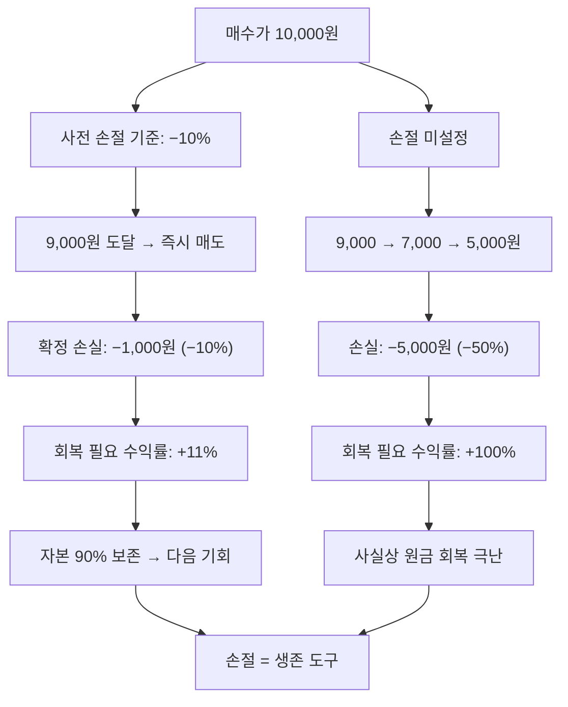

# 손절(Stop Loss) — 손실을 인정하고 끊는 기술

## 한 줄 정의

손절은 보유 종목의 손실이 사전에 정한 기준에 도달했을 때 추가 손실을 막기 위해 매도하는 행위입니다.

## 아주 쉽게 말하면

배에 물이 새고 있습니다. 물이 발목까지 찼을 때 배를 버리면 수영으로 살 수 있습니다. 하지만 "곧 멈추겠지"라며 기다리다가 허리까지 차면, 그때는 탈출 자체가 어려워집니다. 손절은 "물이 여기까지 차면 무조건 탈출한다"는 사전 규칙입니다. 감정이 아니라 규칙으로 파는 것이 핵심입니다.

## 왜 중요한가

- 소액 손실이 대형 손실로 번지는 것을 구조적으로 방지합니다
- −50%가 되면 원금 회복에 +100%가 필요합니다 — 수학적으로 극도로 불리합니다
- 감정적 물타기를 차단하여 자본을 보존합니다
- 다른 기회에 자본을 재배치할 수 있게 합니다
- 투자의 생존율을 결정하는 가장 기본적인 리스크 관리 도구입니다

## 그림으로 이해하기

## 숫자로 보는 예시

> ⚠️ 아래 숫자는 개념 설명을 위한 **가상 예시**이며, 실제 투자 데이터가 아닙니다.

가상 투자자 박모씨, '미래건설' 1,000만 원 매수:

| 시나리오 | 손절 실행 (−10%) | 손절 미실행 (버티기) |
|---------|-----------------|-------------------|
| 손실 금액 | −100만 원 | −400만 원 (최저가 −40%) |
| 남은 자본 | 900만 원 | 600만 원 |
| 원금 회복 필요 수익률 | +11% | +67% |
| 회복에 걸리는 시간(연 15% 수익 가정) | 약 9개월 | 약 3.5년 |
| 그 기간 다른 종목에 투자했다면 | +120만 원 | 기회 상실 |

손절로 100만 원을 잃었지만, 300만 원의 추가 손실 + 수 년의 기회비용을 절약했습니다.

## 표로 비교하기

| 손실률 | 원금 회복 필요 수익률 | 체감 난이도 | 교훈 |
|--------|-------------------|-----------|------|
| −5% | +5.3% | 쉬움 | 작은 손실은 금방 회복 |
| −10% | +11.1% | 보통 | 적정 손절 구간 |
| −20% | +25.0% | 어려움 | 위험 구간 진입 |
| −30% | +42.9% | 매우 어려움 | 회복에 1~2년 |
| −50% | +100.0% | 극난 | 사실상 재기 어려움 |
| −70% | +233.3% | 거의 불가 | 투자 실패 |

## 초보자가 자주 하는 오해

**오해 1: "조금만 더 기다리면 올라올 거야"**

근거 없는 희망은 전략이 아닙니다. 하락 이유가 펀더멘털 훼손이라면 회복 보장이 없습니다. "반등할 것 같다"는 감정이지, 분석이 아닙니다.

**오해 2: "손절하면 무조건 손해 확정이니까 안 파는 게 낫다"**

평가손실이든 확정손실이든 손실은 이미 발생한 상태입니다. 매도 여부는 "지금부터의 전망"으로 판단해야 합니다. "팔지 않으면 손해가 아니다"는 심리적 착각입니다.

**오해 3: "손절 = 실패"**

손절은 실패가 아니라 리스크 관리 행위입니다. 10번 투자 중 6번 손절하더라도 나머지 4번의 수익이 크면 총 수익은 플러스입니다. 손절은 "다음 기회를 위한 자본 보존"입니다.

**오해 4: "손절 기준은 모든 종목에 −10%로 동일하게"**

변동성이 큰 성장주에 −10% 기준을 적용하면 정상적 조정에도 매번 손절됩니다. 종목 특성, 변동성, 투자 논리에 따라 손절 기준을 차등 설정해야 합니다.

## 고수는 이렇게 봅니다

- 매수 시점에 손절 기준을 미리 설정합니다 (매수 전 결정)
- 기술적 손절(차트 지지선 이탈)과 펀더멘털 손절(투자 논리 붕괴)을 구분합니다
- 포지션 크기와 손절폭을 연동하여 1회 최대 손실을 총자산의 1~2%로 제한합니다
- 손절 후 반드시 복기를 통해 매수 판단의 오류를 분석하고 개선합니다
- "손절이 아까워서" 비중을 줄이는 분할 청산도 활용합니다

## 기업분석에서는 이렇게 씁니다

기업분석 관점의 손절 기준은 단순히 주가 %가 아니라 투자 아이디어(thesis)의 훼손입니다:

- 핵심 성장 동력이 사라졌을 때 (주요 고객사 이탈, 기술 대체)
- 경쟁사에 시장을 빼앗기고 있을 때 (점유율 3분기 연속 감소)
- 재무 건전성이 급격히 악화되었을 때 (부채비율 급등, 유동성 위기)
- 경영진 신뢰가 무너졌을 때 (횡령, 허위 공시, 약속 불이행)

이처럼 "왜 샀는지"가 무너지면 가격과 무관하게 매도를 검토합니다.

## 함께 보면 좋은 용어

- [분산투자](./diversification.md): 손절 빈도를 줄이는 구조적 방법
- [집중투자](./concentration.md): 손절 기준이 더 엄격해야 하는 이유
- [안전마진](./margin-of-safety.md): 손절 확률 자체를 낮추는 매수 전략
- [투자 아이디어](./investment-thesis.md): 펀더멘털 손절의 판단 기준
- [분할매수](./dollar-cost-averaging.md): 손절과 반대로 분할 진입하는 전략

## 정리

손절은 실패가 아니라 리스크 관리 도구입니다. 미리 정한 기준에 따라 감정 없이 실행하면 자본을 보존하고, 더 나은 기회에 재배치할 수 있습니다. 수학적으로 손실이 커질수록 회복이 기하급수적으로 어려워지므로, "작은 손실에서 끊는 습관"이 장기 생존의 핵심입니다.

## 한 줄 요약

> 손절은 "틀렸을 때 얼마까지 잃을 것인가"를 미리 정하는 투자자의 안전장치입니다.

---

이 글은 투자 권유가 아니라 주식 용어와 기업분석 방법을 설명하기 위한 교육 콘텐츠입니다. 특정 종목의 매수·매도 판단은 독자 본인의 책임입니다.

Tags: 손절, 손절매, 리스크관리, 손실제한, 매도기준
