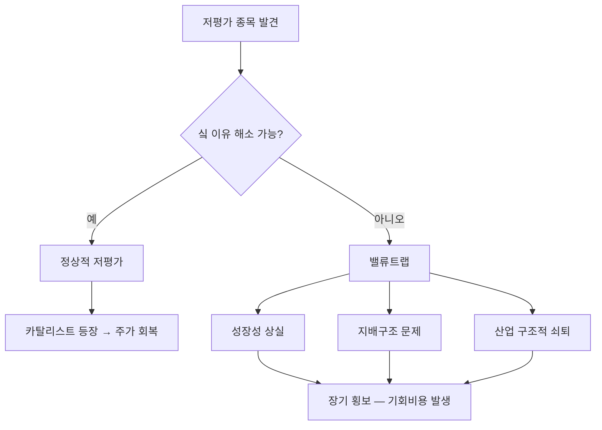

# 밸류트랩 뜻 — 싸 보이지만 계속 싼 채로 머무는 함정

## 한 줄 정의

밸류트랩(Value Trap)은 밸류에이션 지표상 저평가로 보이지만, 구조적 이유로 주가가 회복되지 않는 종목입니다.

## 아주 쉽게 말하면

세일 중인 물건이 "원래 안 팔리는 물건이라 세일하는 것"인 경우입니다. 싸다고 샀는데 영원히 세일 가격에 머무릅니다.

## 왜 중요한가

- PER·PBR이 낮다고 무조건 좋은 투자가 아닙니다
- 밸류트랩에 빠지면 돈이 장기간 묶이는 기회비용이 발생합니다
- "싼 이유"가 해소될 수 있는지가 핵심 판단 기준입니다
- 가치투자의 가장 큰 위험 중 하나입니다

## 그림으로 이해하기

## 숫자로 보는 예시

> ⚠️ 아래 숫자는 개념 설명을 위한 **가상 예시**이며, 실제 투자 데이터가 아닙니다.

밸류트랩 K기업:

- PER 4배, PBR 0.3배, 배당수익률 2%
- 5년간 주가 변동: -20% (시장은 +50%)
- 이유: 매년 이익 5% 감소, 현금 쌓아두고 투자·배당 안 함, 대주주 사익 편취 의혹

"숫자상 싸지만" 싼 이유가 구조적이므로 해소 기미가 없습니다.

## 표로 비교하기

| 구분 | 진짜 저평가 | 밸류트랩 |
|------|-----------|---------|
| PER/PBR | 낮음 | 낮음 |
| 이익 추세 | 안정 or 상승 | 감소 |
| 주주환원 | 개선 의지 | 무관심 |
| 카탈리스트 | 존재 | 부재 |
| 지배구조 | 양호 | 문제 |
| 산업 전망 | 안정~성장 | 사양화 |

## 초보자가 자주 하는 오해

**오해 1: "PBR 0.5배면 무조건 저평가다"**

자산을 활용해 이익을 내지 못하는 기업은 PBR이 낮아도 정당합니다. ROE가 낮으면 PBR도 낮은 것이 맞습니다.

**오해 2: "기다리면 언젠가 오른다"**

구조적 문제가 있는 기업은 5년, 10년이 지나도 저평가가 해소되지 않습니다. 시간은 투자자의 비용입니다.

## 고수는 이렇게 봅니다

- "왜 싼가?"를 먼저 진단하고, 해소 가능성을 평가합니다
- 이익 추세(감소 중인지), 산업 전망, 지배구조를 체크합니다
- 카탈리스트(경영진 교체, 정책 변화, 행동주의 펀드)가 있는지 확인합니다
- 밸류트랩 의심 시 투자하지 않거나, 카탈리스트 확인 후 진입합니다

## 기업분석에서는 이렇게 씁니다

- 저평가 원인을 명시하고 해소 가능 여부를 분석합니다
- ROE·ROIC 추이를 확인하여 자본 효율성을 판단합니다
- 주주환원 정책 변화 가능성(밸류업 프로그램 등)을 모니터링합니다

## 함께 보면 좋은 용어

- [안전마진](./margin-of-safety.md): 진짜 저평가와 밸류트랩을 구분하는 기준
- [가치주](../level-09-strategy-risk/value-stock.md): 밸류트랩 위험을 안고 있는 스타일
- [PBR](../level-05-valuation/pbr.md): 밸류트랩 종목에서 낮게 나타남
- [ROE](../level-04-ratios/roe.md): 낮은 ROE = 낮은 PBR의 정당한 이유
- [디레이팅](../level-05-valuation/derating.md): 밸류트랩의 또 다른 표현

## 정리

밸류트랩은 밸류에이션 지표상 저평가이지만 구조적 이유로 주가가 회복되지 않는 함정입니다. "왜 싼가"를 진단하고, 이유가 해소될 카탈리스트가 있는지 확인하는 것이 밸류트랩을 피하는 핵심입니다.

## 한 줄 요약

> 밸류트랩은 싸 보이지만 싼 이유가 해소되지 않아 계속 저평가에 머무는 함정입니다.

---

*면책 조항: 이 글은 투자 권유가 아니라 주식 용어와 기업분석 방법을 설명하기 위한 교육 콘텐츠입니다. 특정 종목의 매수·매도 판단은 독자 본인의 책임입니다.*

Tags: 밸류트랩, 가치함정, 저PER, 저PBR, 만년저평가
