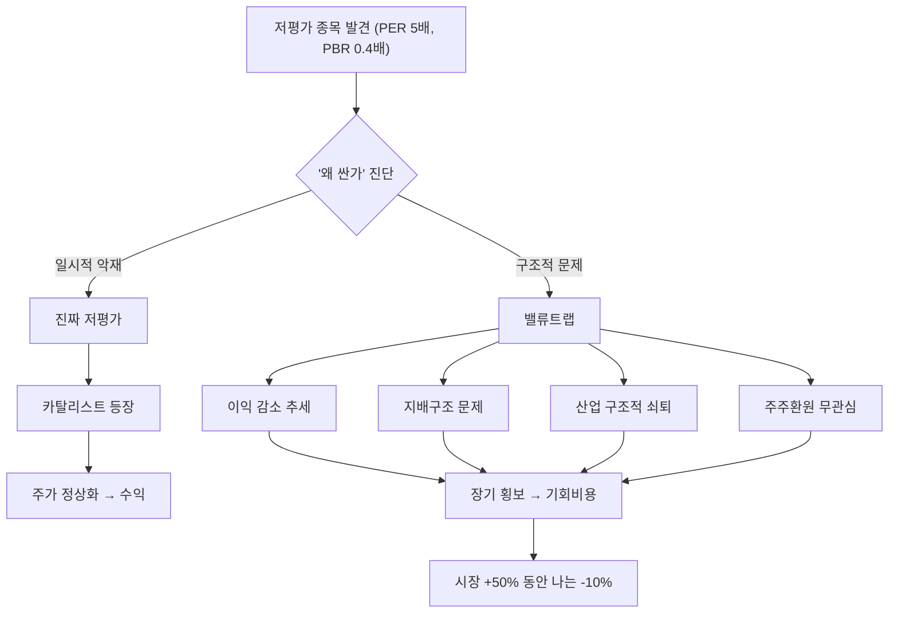

# 밸류트랩 뜻 — 싸 보이지만 계속 싼 채로 머무는 함정

## 한 줄 정의

밸류트랩(Value Trap)은 밸류에이션 지표상 저평가로 보이지만, 구조적 이유로 주가가 회복되지 않는 종목입니다.

## 아주 쉽게 말하면

마트에서 90% 할인 중인 제품을 발견했습니다. "대박 싸다!" 하고 집어 왔는데, 알고 보니 유통기한이 지난 것이었습니다. 주식도 마찬가지로, 싸 보이는 데는 이유가 있습니다. 그 이유가 해결 불가능한 구조적 문제라면, 아무리 기다려도 "정상 가격"으로 돌아오지 않습니다.

## 왜 중요한가

- PER·PBR이 낮다고 무조건 좋은 투자가 아닙니다 — "왜 싼가"가 핵심입니다
- 밸류트랩에 빠지면 3~5년간 돈이 묶이는 기회비용이 발생합니다
- "싼 이유"가 해소될 카탈리스트가 있는지가 핵심 판단 기준입니다
- 가치투자의 가장 큰 위험 중 하나로, 초보 가치투자자가 흔히 빠지는 함정입니다
- 시장은 종종 구조적 문제를 정확히 반영하고 있으며, "시장이 틀렸다"는 가정은 위험합니다

## 그림으로 이해하기

## 숫자로 보는 예시

> ⚠️ 아래 숫자는 개념 설명을 위한 **가상 예시**이며, 실제 투자 데이터가 아닙니다.

가상 기업 '대한중공업' — 전형적 밸류트랩 사례:

| 항목 | 수치 | 해석 |
|------|------|------|
| PER | 4배 | 숫자만 보면 극단적 저평가 |
| PBR | 0.3배 | 자산 대비 주가 매우 낮음 |
| 배당수익률 | 1.5% | 이익 대비 주주환원 미미 |
| 영업이익 추이 | 5년 연속 감소 (−8%/년) | 수익성 지속 악화 |
| ROE | 3% (업종 평균 10%) | 자본 활용 비효율적 |
| 대주주 지분율 | 68% | 소액주주 의견 반영 어려움 |
| 5년 주가 변동 | −25% (시장 +45%) | 저평가 해소 기미 없음 |

결론: PER 4배의 "저평가"는 이익 감소 + 낮은 ROE + 지배구조 문제가 반영된 정당한 가격이었습니다.

## 표로 비교하기

| 구분 | 진짜 저평가 | 밸류트랩 |
|------|-----------|---------|
| PER/PBR | 낮음 | 낮음 |
| 이익 추세 | 안정 or 상승 전환 | 지속 감소 |
| ROE 수준 | 업종 평균 이상 | 업종 평균 미만 |
| 주주환원 | 개선 의지 (배당 증가, 자사주) | 무관심 |
| 카탈리스트 | 존재 (신사업, 구조조정) | 부재 |
| 지배구조 | 양호 (이사회 독립성) | 문제 (오너 리스크) |
| 산업 전망 | 안정~성장 | 사양화·축소 |

## 초보자가 자주 하는 오해

**오해 1: "PBR 0.5배면 무조건 저평가다"**

자산을 활용해 이익을 내지 못하는 기업은 PBR이 낮아도 정당합니다. ROE 2%인 기업의 PBR 0.5배는 시장이 "이 자산이 수익을 못 낸다"고 판단한 결과입니다.

**오해 2: "기다리면 언젠가 오른다"**

구조적 문제가 있는 기업은 5년, 10년이 지나도 저평가가 해소되지 않습니다. 그 시간에 시장은 50~100% 올랐을 수 있습니다. 시간은 투자자의 가장 비싼 비용입니다.

**오해 3: "배당이라도 받으니까 괜찮다"**

밸류트랩 기업의 배당은 대체로 1~2%에 불과합니다. 주가가 매년 −5% 하락하면서 배당 2%를 받으면 순손실 −3%입니다. 기회비용까지 합산하면 피해는 더 큽니다.

**오해 4: "밸류업 프로그램이 생기면 해소된다"**

정책 기대만으로는 부족합니다. 실제로 배당·자사주 실행 + 이익 반등이 확인되어야 밸류트랩이 해소됩니다. 기대만으로 진입하면 또 다른 함정에 빠집니다.

## 고수는 이렇게 봅니다

- "왜 싼가?"를 먼저 진단하고, 이유가 일시적인지 구조적인지 평가합니다
- 이익 추세(최근 3년 연속 감소 여부), 산업 전망, 지배구조를 체크합니다
- 카탈리스트(경영진 교체, 정책 변화, 행동주의 펀드 진입)가 구체적으로 있는지 확인합니다
- 밸류트랩 의심 종목에는 투자하지 않거나, 카탈리스트가 실현된 후 진입합니다
- "싼 게 비싼 것"이라는 격언을 항상 경계합니다

## 기업분석에서는 이렇게 씁니다

- 저평가 원인을 3가지 이상 나열하고, 각각의 해소 가능성을 A/B/C 등급으로 평가합니다
- ROE·ROIC 3년 추이를 확인하여 자본 효율성이 개선 중인지 판단합니다
- 주주환원 정책 변화 가능성(밸류업 프로그램, 행동주의 펀드)을 모니터링합니다
- "저평가 해소에 걸리는 기간 vs 기회비용"을 명시적으로 비교합니다

## 함께 보면 좋은 용어

- [안전마진](./margin-of-safety.md): 진짜 저평가와 밸류트랩을 구분하는 기준
- [가치주](../level-09-strategy-risk/value-stock.md): 밸류트랩 위험을 안고 있는 스타일
- [PBR](../level-05-valuation/pbr.md): 밸류트랩 종목에서 낮게 나타남
- [ROE](../level-04-ratios/roe.md): 낮은 ROE = 낮은 PBR의 정당한 이유
- [디레이팅](../level-05-valuation/derating.md): 밸류트랩의 또 다른 표현

## 정리

밸류트랩은 밸류에이션 지표상 저평가이지만 구조적 이유로 주가가 회복되지 않는 함정입니다. "왜 싼가"를 진단하고 이유가 일시적인지 구조적인지 판별한 뒤, 해소될 카탈리스트가 구체적으로 존재하는지 확인하는 것이 밸류트랩을 피하는 핵심입니다.

## 한 줄 요약

> 밸류트랩은 싸 보이지만 싼 이유가 해소되지 않아 계속 저평가에 머무는 함정입니다.

---

이 글은 투자 권유가 아니라 주식 용어와 기업분석 방법을 설명하기 위한 교육 콘텐츠입니다. 특정 종목의 매수·매도 판단은 독자 본인의 책임입니다.

Tags: 밸류트랩, 가치함정, 저주가수익비율, 저주가순자산비율, 만년저평가
